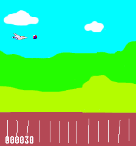

# FrameGen #

This is an experimental program to generate a sequence of video frames
resembling the game "Defender".
Apart from having a parallax-scrolling background of fields and clouds, that is.
Maybe it's more like "Scramble", but I've only played the Vectrex version of that game.

I wrote it in December 2011 as a first step towards a fully interactive program that could
display directly on the PC's screen.
Another iteration used the SVGAlib to draw directly to the VGA screen in 320x200 mode.
But this version generates numerous PPM format still images and then assembles them,
along with a soundtrack, into a video file by using 'ffmpeg'.

## Sample Video Frame ##

Frame 30, just after the missile has been fired from the spaceship:

## Compilation Options ##

In the source code, there's a commented-out #define called "SD".
This is nothing to do with SD cards but controls the resolution of the generated images,
and hence the resolution of the final video.
"SD" stands for Standard Definition, or 720x576.
At the time that I wrote this,
the idea of a full Standard Definition video file was just too big to contemplate.
I used a default resolution of 224x240, which is the same as the Super Nintendo console.
In future,
I might add HD video at the astonishingly high resolution of 1920x1080.

## Compiling and Building ##

To compile this code, you'll need the usual 'build-essential' package:

`sudo apt install build-essential`

along with 'ffmpeg':

`sudo apt install ffmpeg`

Once those are installed, you can simply run 'make':

`make`

The Makefile compiles the C code, runs it,
and then invokes 'ffmpeg' to generate the video file from the many PPM images.

To clean up the generated frames and audio, but leave the video intact, use:

`make clean`

Another useful tool is Audacity, for checking the audio file:

`sudo apt install audacity`

